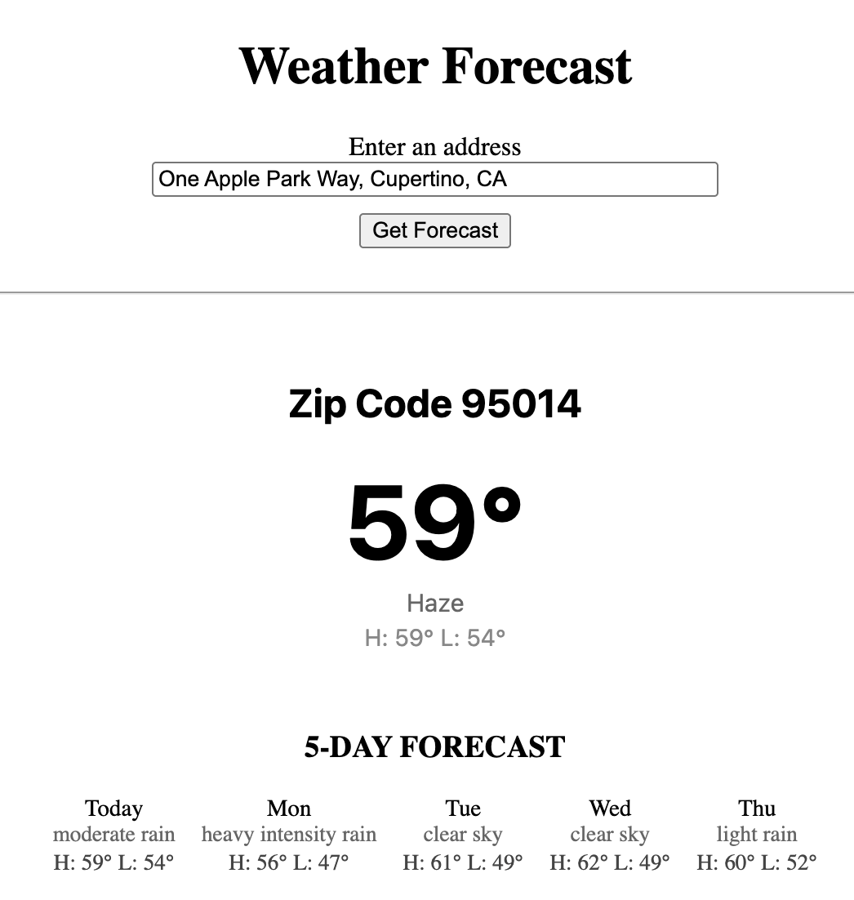
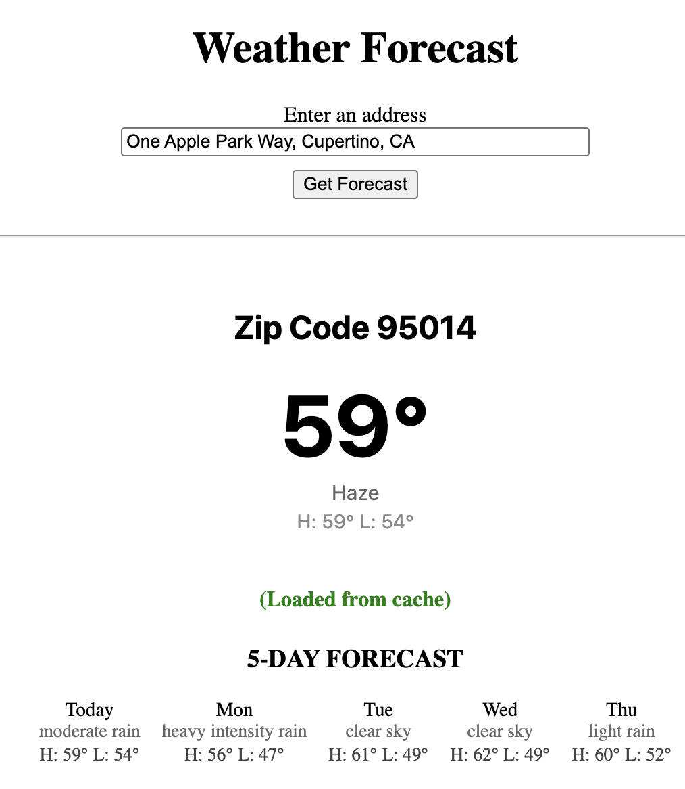
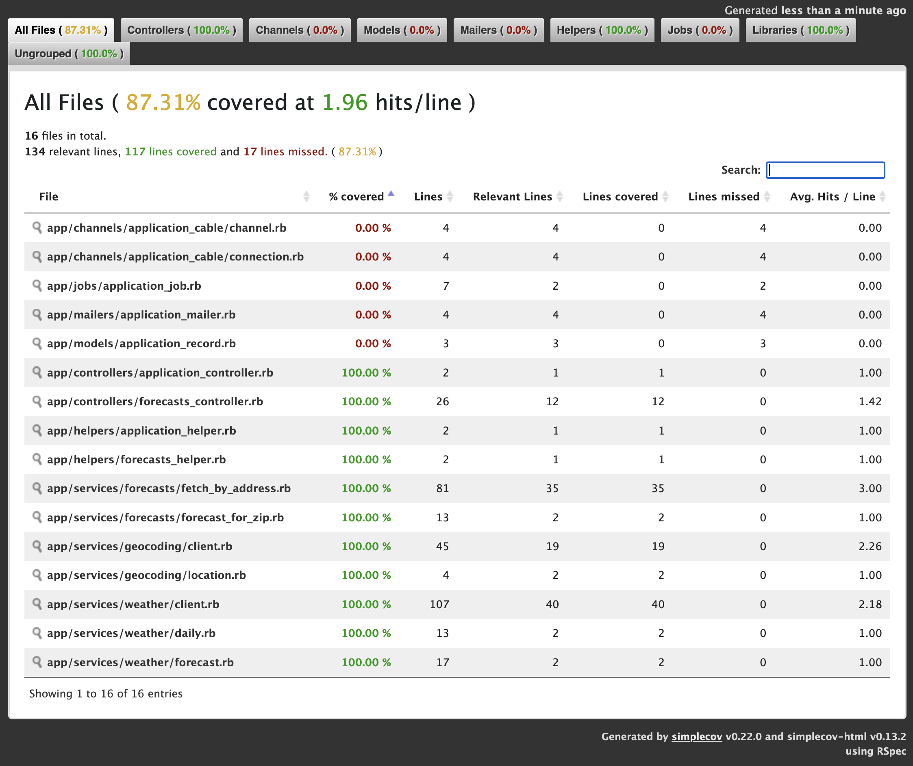

# Weather Forecast

This Rails application takes a user entered address, converts it into geographic
coordinates and a ZIP code, fetches current and extended weather data, and
renders the results through a simple UI.

---

## Requirements

- **Ruby:** 3.2+
- **Rails:** 7+
- **Bundler**
- **Google Geocoding API key**
- **OpenWeather OneCall 3.0 API key**

Run setup:

```bash
bundle install
export GOOGLE_GEOCODING_API_KEY=your_google_key
export OPENWEATHER_API_KEY=your_openweather_key
bin/rails server
```

---

## High‑Level Architecture

### Request Flow

1. The user enters an address.
2. `ForecastsController#create` delegates to `Forecasts::FetchByAddress`.
3. The service:
   - Geocodes the address into `{ latitude, longitude, postal_code }`
   - Caches forecasts by ZIP code for 30 minutes
   - Calls `Weather::Client` on cache miss
4. The controller renders:
   - Current temperature and description
   - Today’s high/low
   - Cache indicator (cache hit or not)
   - Five‑day extended forecast

---

## Object Decomposition

Responsibilities are divided as follows:

### **1. Geocoding::Client**

**Purpose:** Wraps the Geocoder gem so the rest of the app never deals with
provider‑specific objects or error handling.  
**Returns:** A simple `Location` object with latitude, longitude, and postal code.  
**Handles:** Missing results, irregular provider payloads, and failure cases.

### **2. Weather::Client**

**Purpose:** Wraps the OpenWeather OneCall API behind an injectable HTTP client.  
**Returns:** A `Weather::Forecast` object with current and extended data.  
**Handles:** Timeouts, API errors, and JSON inconsistencies.

### **3. Forecasts::FetchByAddress**

**Purpose:** Implements the overall use‑case workflow.  
**Steps:**

- Validate address
- Geocode
- Determine ZIP
- Look up weather (with caching)
- Surface domain‑level errors

This keeps the controller extremely small and keeps provider concerns isolated.

### **4. ForecastsController**

**Purpose:**

- Collects user input
- Delegates to the service
- Displays results or friendly error messages

### **5. Value Objects**

- `Weather::Forecast`
- `Weather::Daily`
- `Forecasts::ForecastForZip`

These protect the UI from raw JSON and lock down the domain shape.

---

## Design Patterns Used

- **Service Objects:** External API wrappers (`Geocoding::Client`, `Weather::Client`)
- **Use‑Case / Orchestrator:** `Forecasts::FetchByAddress`
- **Value Objects (Structs):** Forecast, Daily, Location, ForecastForZip
- **Thin Controller:** Classical Rails pattern for maintainability
- **Dependency Injection:** Inject HTTP client, cache store, and timeouts for testability
- **Defensive Error Mapping:** Provider‑level failures become stable domain errors

---

## Caching

- Key format: `weather_by_zip/v1/<ZIP>`
- TTL: `30.minutes` (configurable in `config.x.forecasts.cache_ttl`)
- Calling the same ZIP repeatedly hits the cache instead of the weather API

The `v1` namespace supports future schema changes without breaking old entries.

---

## Scalability Considerations

- All external interactions are isolated behind service boundaries—ideal for:
  - Swapping weather providers
  - Adding retries or rate‑limit handling
  - Plugging in circuit breakers
- Caching reduces API calls dramatically under real workloads
- Value objects guarantee consistent shape even if upstream responses vary

---

## Running Tests

```bash
bundle exec rspec
```

Test suite includes:

- Unit tests for:
  - `Geocoding::Client`
  - `Weather::Client`
  - `Forecasts::FetchByAddress`
- Request tests for:
  - `ForecastsController`
- A realistic sample OpenWeather payload fixture

---

## Code Coverage

Coverage is generated via SimpleCov:

```
coverage/index.html
```

This implementation ships with full test coverage for all non-Rails application code.

---

## UI Overview

The `forecasts/new.html.erb` template includes:

- Address input form
- “Today” label for the first daily item
- Current conditions
- ZIP code heading
- Cache indicator
- Five‑day forecast section

Styling lives in `app/assets/stylesheets/forecasts.css`, kept intentionally minimal.

---

## Folder Structure Overview

```
app/
  controllers/
    forecasts_controller.rb
  services/
    forecasts/
      fetch_by_address.rb
      forecast_for_zip.rb
    geocoding/
      client.rb
    weather/
      client.rb
      daily.rb
      forecast.rb
  views/
    forecasts/
      new.html.erb
spec/
  services/
  requests/
  fixtures/
    weather/
      openweather_one_call_sample.json
config/
  initializers/
    geocoder.rb
    forecast.rb
    external_apis.rb
```

## Privacy & Logging

This application processes user-entered street addresses, which are treated as **PII** (Personally Identifiable Information). To protect user privacy, the codebase follows strict defensive logging rules:

### 🔒 PII Safety Measures

- **Raw addresses are never logged.**  
  All service layers log only exception classes or high-level context — never user input.

- **Geocoder provider logging is disabled in production.**  
  This prevents upstream error payloads (which often echo the full address) from appearing in logs.

- **Error handlers intentionally avoid including PII.**  
  When failures occur (geocoding errors, API timeouts, etc.), user-friendly messages are returned to the UI, while logs only receive non-PII diagnostics.

- **Rails parameter filtering is enabled.**  
  In `config/application.rb`, the `:address` parameter is added to `config.filter_parameters`, ensuring request logs redact it in all environments.

- **RSpec tests enforce PII-safe behavior.**  
  The test suite includes checks confirming that address strings never appear in logged error messages.

### 🛡️ Summary

These safeguards ensure that user addresses never leak into application logs, provider logs, or exception traces — supporting secure handling of sensitive data across the entire request lifecycle.

## Screenshots

### Non-cached forecast


<br><br>

### Cached forecast


<br><br>

## Test Coverage


